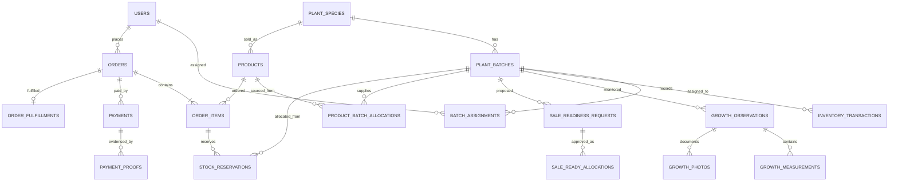

# PRODUCT REQUIREMENTS DOCUMENT (PRD)

## Sistem Informasi Inventory, Monitoring Pertumbuhan, dan Online Order Tanaman pada Nursery Berbasis Web

| Metadata | Ketentuan final |
|---|---|
| Versi | 2.0 — baseline implementasi skripsi |
| Tanggal | 22 September 2026 |
| Organisasi | CV. Delta Sinergi Utama (DSU) |
| Tujuan | Project skripsi / tugas akhir |
| Modul inti | Inventory tanaman; monitoring pertumbuhan; online order |
| Aktor | **ADMIN, PETUGAS, PELANGGAN — tepat tiga aktor** |
| Penanggung jawab monitoring | **PETUGAS**, dengan input pengukuran manual |
| Platform | Web responsif, portal internal dan portal pelanggan |
| Frontend | Next.js App Router + TypeScript + Tailwind CSS + shadcn/ui |
| Backend | Node.js + Express + TypeScript, REST API |
| Database | PostgreSQL + Prisma ORM |
| Pembayaran MVP | Transfer bank manual, bukti bayar, verifikasi ADMIN |
| Status dokumen | Final sebagai *baseline pengembangan*; fakta operasional dan kriteria agronomis tetap memerlukan validasi objek penelitian |

> **Sumber kebenaran:** Dokumen ini mengesampingkan versi PRD terdahulu apabila terdapat perbedaan peran atau alur. Tidak ada aktor Kepala Nursery/Manajer. PETUGAS berfokus pada monitoring tanaman; ADMIN mengelola inventory, katalog, verifikasi kesiapan jual, pembayaran, dan pesanan. Logo DSU asli tidak boleh digambar ulang atau diubah bentuknya. Implementasi visual mengikuti `style.md` yang telah diselaraskan dengan identitas perusahaan; bila dokumen style yang tersimpan masih memakai tema hijau sebagai warna merek utama, perbarui dahulu ke identitas biru DSU.

---

## 1. Ringkasan produk dan sasaran

Aplikasi mengintegrasikan persediaan tanaman per jenis/batch/lokasi, pengamatan pertumbuhan manual oleh PETUGAS, serta pemesanan tanaman secara online oleh PELANGGAN. ADMIN menetapkan stok siap jual berdasarkan hasil monitoring, mengelola katalog dan harga, memverifikasi pembayaran, serta memproses pemenuhan pesanan. Tanaman yang masih dalam pembibitan atau sudah dipesan tidak boleh ditampilkan sebagai stok yang bebas dipesan.

### 1.1 Sasaran yang dapat diuji

- Seluruh perubahan stok dapat ditelusuri ke transaksi dan pengguna yang berwenang.
- PETUGAS dapat menyimpan pengukuran per batch, waktu, sampel, parameter, dan foto tanpa akses untuk mengubah harga atau memverifikasi pembayaran.
- PELANGGAN dapat menyelesaikan alur katalog → keranjang → checkout → pembayaran manual → pelacakan pesanan.
- ADMIN dapat memverifikasi kesiapan jual, memublikasikan produk, memproses pesanan, dan melihat laporan.
- Reservasi stok dan pemenuhan pesanan tidak menyebabkan stok negatif atau overselling, termasuk saat checkout bersamaan.

### 1.2 Batasan MVP

**Termasuk:** autentikasi dan RBAC tiga aktor; master tanaman/batch/lokasi; transaksi inventory; monitoring manual dan grafik; pengajuan dan persetujuan siap jual; katalog; keranjang; checkout; reservasi stok; pembayaran transfer manual; pemenuhan/pengambilan pesanan; dashboard dan laporan dasar.

**Tidak termasuk:** IoT, AI/ML, diagnosis penyakit otomatis, payment gateway, perhitungan ongkir/ekspedisi otomatis, multi-tenant, akuntansi lengkap, aplikasi mobile native, marketplace eksternal, dan role keempat.

**Asumsi operasional:** Satu organisasi nursery dengan berbagai jenis tanaman; harga per produk ditentukan ADMIN; satu produk dapat dipenuhi dari lebih dari satu batch yang lolos verifikasi; metode pemenuhan MVP adalah pengambilan di nursery. Pengiriman dapat ditambahkan setelah kebijakan dan tarif disepakati.

---

## 2. Aktor, kewenangan, dan batasan

| Fitur | ADMIN | PETUGAS | PELANGGAN |
|---|---|---|---|
| Dashboard | Operasional, stok, penjualan, monitoring | Tugas dan monitoring | Ringkasan akun/pesanan |
| Pengguna | Kelola akun/role | Profil sendiri | Registrasi/profil sendiri |
| Master tanaman, lokasi, batch | Kelola | Baca batch yang ditugaskan | Hanya produk publik |
| Inventory | Catat, koreksi terotorisasi, rekonsiliasi | Lihat stok batch terkait; laporkan temuan, **tidak posting transaksi stok** | Lihat stok tersedia pada katalog |
| Monitoring pertumbuhan | Lihat hasil dan evaluasi | **Buat, lihat, koreksi sesuai kebijakan dan audit** | Tidak mengakses data internal |
| Kesiapan jual | Verifikasi/setujui/tolak | Ajukan berdasarkan observasi | Lihat produk yang sudah dipublikasikan |
| Katalog dan harga | Kelola/publikasi | Tidak | Lihat |
| Keranjang/checkout | Tidak | Tidak | Kelola milik sendiri |
| Pembayaran | Verifikasi/tolak | Tidak | Unggah bukti untuk pesanan sendiri |
| Pesanan/pemenuhan | Kelola dan selesaikan | Tidak | Lihat status milik sendiri |
| Laporan | Semua laporan | Laporan monitoring tugas sendiri | Riwayat pesanan sendiri |

**Aturan akses:** Semua endpoint melakukan pemeriksaan autentikasi, role, dan kepemilikan objek di backend. UI yang menyembunyikan menu bukan mekanisme otorisasi. Tidak ada halaman, role, atau use case Kepala Nursery.

---

## 3. Alur bisnis lintas modul

1. ADMIN membuat master jenis tanaman, parameter pertumbuhan, lokasi, batch, dan transaksi penerimaan stok awal.
2. ADMIN menugaskan batch kepada PETUGAS; PETUGAS mengukur tanaman, mencatat sampel/hasil/foto/kondisi secara berkala.
3. Jika ada tanaman mati atau ketidaksesuaian stok, PETUGAS mengirim **laporan temuan**; ADMIN memeriksa dan mem-posting transaksi inventory. Menyimpan observasi tidak otomatis mengubah stok.
4. PETUGAS mengajukan jumlah tanaman siap jual dari batch tertentu disertai referensi observasi. ADMIN menyetujui atau menolak jumlah tersebut berdasarkan kriteria yang telah ditetapkan.
5. ADMIN membuat/memperbarui produk, harga, foto katalog, dan publikasi. Hanya stok siap jual yang telah disetujui dan belum dialokasikan yang dapat dipesan.
6. PELANGGAN memilih produk, checkout, dan mendapat reservasi stok atomik dengan batas waktu pembayaran yang dikonfigurasi.
7. PELANGGAN mengunggah bukti transfer; ADMIN memverifikasi nominal dan bukti. Bukti unggahan saja **tidak** otomatis menjadikan pesanan dibayar.
8. ADMIN memproses pengambilan/pemenuhan; saat tanaman benar-benar keluar, sistem mencatat pengurangan stok fisik dan menutup reservasi terkait dalam satu transaksi database.
9. Jika pesanan dibatalkan atau reservasi kedaluwarsa sebelum pemenuhan, sistem melepaskan alokasi tanpa menambah stok fisik. Laporan dan dashboard diperbarui.

### 3.1 Aturan stok dan status

- **Stok fisik:** saldo dari transaksi penerimaan, kematian, penyesuaian, mutasi lokasi, dan pengeluaran fisik.
- **Stok siap jual disetujui:** bagian stok fisik yang telah dinyatakan layak jual oleh ADMIN dan belum dicabut statusnya.
- **Stok terreservasi:** kuantitas yang dialokasikan ke pesanan aktif dan belum dipenuhi/dilepas.
- **Stok dapat dipesan:** `max(0, stok siap jual disetujui - stok terreservasi)`; perhitungan dilakukan per batch/lokasi dan diagregasi per produk.
- Kuantitas siap jual tidak boleh melebihi stok fisik yang masih tersedia pada batch/lokasi; kematian atau penyesuaian harus mengurangi kapasitas siap jual dan memicu pemeriksaan apabila memengaruhi reservasi aktif.
- Keranjang **tidak** mereservasi stok; reservasi dibuat pada checkout berhasil. Harga pada `order_items` merupakan snapshot harga saat checkout dan tidak berubah ketika harga katalog diperbarui.
- Checkout, reservasi, pelepasan, serta pemenuhan wajib menggunakan transaksi database dan locking/conditional update yang mencegah overselling. Gunakan idempotency key untuk retry checkout/pembayaran/pemenuhan.
- Semua transaksi stok memiliki referensi sumber, waktu, pelaku, alasan, dan jejak audit; koreksi dilakukan melalui transaksi kompensasi, bukan penghapusan riwayat.

### 3.2 State machine pesanan

`PENDING_PAYMENT → PAYMENT_REVIEW → PAID → PROCESSING → READY_FOR_PICKUP → COMPLETED`

Transisi alternatif: `PENDING_PAYMENT/PAYMENT_REVIEW → EXPIRED/CANCELLED` dan `PAYMENT_REVIEW → PAYMENT_REJECTED → PENDING_PAYMENT` jika masih dalam masa pembayaran. Pembatalan setelah pembayaran memerlukan proses refund manual dan audit; jangan otomatis melepas stok apabila pesanan sudah dipenuhi. Hanya ADMIN dapat mengonfirmasi `PAID`, memproses, dan menyelesaikan pesanan.

---

## 4. Kebutuhan fungsional dan acceptance criteria

Prioritas: **P0** wajib MVP, **P1** peningkatan setelah MVP. Setiap ID digunakan sebagai referensi pada `task.md`, API, dan test case.

### 4.1 Identitas dan akses

| ID | Prioritas | Kebutuhan | Kriteria penerimaan |
|---|---|---|---|
| AUTH-01 | P0 | Login/logout tiga role dan session aman | Pengguna berhasil masuk/keluar; endpoint terlindungi menolak akses tanpa session. |
| AUTH-02 | P0 | Registrasi pelanggan; akun petugas dibuat ADMIN | Registrasi publik selalu menghasilkan role PELANGGAN; role tidak dapat diubah melalui request publik. |
| AUTH-03 | P0 | RBAC dan object-level authorization | PETUGAS tidak dapat mengubah stok/harga; pelanggan tidak dapat membaca pesanan pelanggan lain; tidak ada role keempat. |
| AUTH-04 | P0 | Manajemen pengguna oleh ADMIN | ADMIN dapat membuat/nonaktifkan petugas dan melihat pelanggan tanpa mengakses kata sandi asli. |

### 4.2 Inventory tanaman

| ID | Prioritas | Kebutuhan | Kriteria penerimaan |
|---|---|---|---|
| INV-01 | P0 | Master kategori, jenis, lokasi, batch | ADMIN dapat CRUD sesuai kebijakan; kode unik dan referensi valid. |
| INV-02 | P0 | Penerimaan dan transaksi stok | Setiap transaksi mengubah saldo sesuai jenisnya, tercatat dengan pelaku dan waktu. |
| INV-03 | P0 | Kematian, penyesuaian, mutasi lokasi | Tidak ada saldo negatif; mutasi tidak mengubah total stok organisasi. |
| INV-04 | P0 | Tampilan stok fisik, siap jual, terreservasi, tersedia | Angka sesuai rekonsiliasi transaksi dan reservasi aktif. |
| INV-05 | P0 | Laporan temuan petugas | PETUGAS mengirim temuan; hanya ADMIN dapat mem-posting koreksi stok setelah verifikasi. |
| INV-06 | P0 | Audit transaksi | Transaksi yang disahkan tidak dapat dihapus/diubah tanpa jejak koreksi. |

### 4.3 Monitoring pertumbuhan oleh PETUGAS

| ID | Prioritas | Kebutuhan | Kriteria penerimaan |
|---|---|---|---|
| MON-01 | P0 | Daftar batch yang ditugaskan | PETUGAS hanya dapat mencatat pada batch dalam lingkup tugasnya. |
| MON-02 | P0 | Parameter per jenis tanaman | Form hanya meminta parameter yang berlaku; satuan dan batas validasi ditampilkan. |
| MON-03 | P0 | Observasi manual per tanggal, batch, dan sampel | Data mencatat waktu, petugas, metode sampling, jumlah sampel, dan hasil pengukuran. |
| MON-04 | P0 | Dokumentasi foto dan kondisi kesehatan | Foto bertipe/berukuran valid; file tersimpan dengan akses sesuai hak; kondisi merupakan input petugas, bukan diagnosis AI. |
| MON-05 | P0 | Riwayat dan grafik pertumbuhan | Grafik menghitung agregat dari sampel yang tersimpan dan menampilkan periode/satuan secara jelas. |
| MON-06 | P0 | Pengajuan kesiapan jual | PETUGAS mengajukan jumlah dan referensi observasi; hanya ADMIN dapat menyetujui; pengajuan tidak otomatis memublikasikan produk. |
| MON-07 | P1 | Jadwal/pengingat observasi | PETUGAS melihat jadwal dan status terlambat berdasarkan konfigurasi. |

**Aturan sampling:** Monitoring berbasis batch boleh memakai sampel; setiap nilai individu diberi `sample_number`. Perbandingan longitudinal tanaman individu hanya boleh diklaim jika identitas tanaman sampel dipertahankan antarsesi. Kriteria agronomis tiap spesies harus dikonfirmasi dengan objek penelitian, bukan dianggap sama untuk semua tanaman.

### 4.4 Online order oleh PELANGGAN

| ID | Prioritas | Kebutuhan | Kriteria penerimaan |
|---|---|---|---|
| ORD-01 | P0 | Katalog dan detail produk | Hanya produk aktif dan disetujui tampil; harga/foto/stok tersedia akurat. |
| ORD-02 | P0 | Pencarian, kategori, keranjang | Kuantitas positif; perubahan keranjang tidak mengurangi stok. |
| ORD-03 | P0 | Checkout dan reservasi atomik | Checkout gagal bila stok tidak cukup; dua checkout bersamaan tidak menghasilkan overselling. |
| ORD-04 | P0 | Alamat/kontak dan metode ambil di nursery | Pesanan menyimpan snapshot informasi pelanggan dan metode pemenuhan. |
| ORD-05 | P0 | Transfer manual dan bukti pembayaran | PELANGGAN mengunggah bukti; status menunggu verifikasi ADMIN. |
| ORD-06 | P0 | Verifikasi pembayaran oleh ADMIN | Hanya ADMIN dapat menandai lunas/menolak dengan alasan dan audit. |
| ORD-07 | P0 | Pemrosesan, pengambilan, penyelesaian | Pengurangan stok fisik tepat sekali ketika barang keluar; reservasi ditutup. |
| ORD-08 | P0 | Pembatalan dan kedaluwarsa reservasi | Reservasi dilepas tepat sekali; stok fisik tidak bertambah karena pelepasan. |
| ORD-09 | P0 | Riwayat dan detail pesanan milik pelanggan | PELANGGAN hanya dapat membaca pesanan miliknya. |
| ORD-10 | P1 | Notifikasi email status pesanan | Notifikasi mengikuti perubahan status yang sudah tersimpan dan dapat di-retry tanpa duplikasi berlebihan. |

### 4.5 Dashboard dan laporan

| ID | Prioritas | Kebutuhan | Kriteria penerimaan |
|---|---|---|---|
| RPT-01 | P0 | Dashboard ADMIN | Menampilkan stok, batch, kesiapan jual, pesanan, dan monitoring berdasarkan data aktual. |
| RPT-02 | P0 | Dashboard PETUGAS | Menampilkan batch tugas dan observasi terbaru tanpa data pembayaran pelanggan. |
| RPT-03 | P0 | Laporan inventory/monitoring/order | Filter periode/batch/jenis/status berfungsi; total dapat ditelusuri ke data sumber. |
| RPT-04 | P1 | Ekspor CSV/PDF | Ekspor menghormati filter dan hak akses. |

---

## 5. Kebutuhan nonfungsional

| ID | Kebutuhan | Kriteria verifikasi |
|---|---|---|
| NFR-01 | Responsif | Halaman utama dapat digunakan pada lebar 360 px, 768 px, dan 1280 px tanpa horizontal overflow yang tidak perlu. |
| NFR-02 | Keamanan | Password di-hash dengan algoritma adaptif; cookie `HttpOnly`, `Secure` di HTTPS, `SameSite` sesuai deployment; proteksi CSRF untuk autentikasi berbasis cookie; rate limiting login. |
| NFR-03 | Integritas data | Foreign key, constraint kuantitas, transaksi atomik, audit, dan tes konkurensi checkout. |
| NFR-04 | Validasi | Semua input tervalidasi server-side; error API konsisten dan tidak membocorkan stack trace. |
| NFR-05 | Aksesibilitas | Label form, fokus keyboard terlihat, kontras memadai, pesan error dapat dipahami, serta alternatif teks gambar relevan. |
| NFR-06 | Performa | Target awal p95 endpoint baca < 1 detik dan checkout < 3 detik pada beban uji yang didefinisikan; hasil harus dilaporkan bersama lingkungan uji, bukan diklaim sebelum diuji. |
| NFR-07 | File dan privasi | Validasi MIME/ukuran file, nama file acak, penyimpanan privat untuk bukti bayar dan foto monitoring internal, URL akses sementara jika diperlukan. |
| NFR-08 | Pemulihan | Backup database dan storage, prosedur restore yang diuji, serta logging kesalahan tanpa mencatat kredensial. |
| NFR-09 | Konsistensi UI | Ikuti identitas biru DSU pada `style.md`; tidak menggunakan hijau sebagai warna merek utama hanya karena domain tanaman. |

---

## 6. Struktur data dan relasi inti

### 6.1 Entitas

| Kelompok | Tabel | Kolom penting / aturan |
|---|---|---|
| Identitas | `users` | id, name, email unique, password_hash, role enum tiga nilai, is_active, timestamps |
| Master | `plant_categories`, `plant_species`, `nursery_locations` | kategori, nama ilmiah/umum, kode unik, lokasi |
| Pembibitan | `plant_batches`, `batch_assignments` | species_id, planting_date, initial_quantity, status; batch_id, petugas_id, active |
| Stok | `inventory_transactions` | batch_id, type, quantity, source_location_id, destination_location_id, created_by, reason, reference, timestamps |
| Monitoring | `growth_parameters`, `species_growth_parameters` | parameter, unit, data_type, required per spesies, batas validasi |
| Monitoring | `growth_observations`, `growth_measurements`, `growth_photos` | batch_id, observed_by, observed_at, sampling_method; sample_number, parameter_id, value; file_key |
| Temuan/kesiapan | `plant_findings`, `sale_readiness_requests`, `sale_ready_allocations` | batch_id, reported_by, status; observation_id, proposed_quantity, approved_quantity, reviewed_by; batch/location/quantity |
| Katalog | `products`, `product_batch_allocations`, `product_images` | species_id, price, is_published; product_id, batch_id, location_id; file_key |
| Pelanggan | `customer_addresses`, `carts`, `cart_items` | user_id, address; user_id; product_id, quantity |
| Order | `orders`, `order_items`, `stock_reservations` | customer_id, status, payment_deadline, total; product_id, quantity, unit_price_snapshot; order_item_id, batch_id, location_id, quantity, status |
| Pembayaran | `payments`, `payment_proofs` | order_id, amount, status, verified_by; file_key, uploaded_by |
| Pemenuhan | `order_fulfillments` | order_id, fulfilled_by, fulfilled_at, status |
| Audit | `audit_logs` | actor_id, action, entity_type, entity_id, before/after redacted, occurred_at |

**Kendala database:** kuantitas transaksi/reservasi > 0; harga >= 0; role hanya ADMIN/PETUGAS/PELANGGAN; `order_items` menyimpan snapshot harga; semua foreign key diindeks sesuai query. Transaksi stok dan reservasi memiliki unique reference/idempotency key untuk mencegah posting ganda. Foto dan bukti bayar menyimpan file key, bukan blob di database.

### 6.2 ERD ringkas



ERD ini adalah peta hubungan inti, bukan pengganti migrasi Prisma. Referensi ke ADMIN/PETUGAS menggunakan `users.id` dan otorisasi role diperiksa oleh service.

---

## 7. REST API (prefix `/api/v1`)

| Method | Endpoint | Role | Tujuan |
|---|---|---|---|
| POST | `/auth/login`, `/auth/logout` | Publik/terautentikasi | Session |
| POST | `/auth/register` | Publik | Registrasi PELANGGAN saja |
| GET | `/auth/me` | Semua terautentikasi | Identitas aktif |
| GET/POST | `/admin/users` | ADMIN | Manajemen akun |
| GET/POST | `/plants`, `/batches`, `/locations` | ADMIN; PETUGAS GET terbatas | Master/batch/lokasi |
| GET | `/inventory/stock` | ADMIN; PETUGAS terbatas | Saldo per batch/lokasi |
| POST | `/inventory/transactions` | ADMIN | Posting transaksi stok |
| POST | `/plant-findings` | PETUGAS | Laporan kematian/selisih stok |
| GET/POST | `/growth/observations` | PETUGAS (scope tugas); ADMIN GET | Monitoring manual |
| POST | `/growth/observations/:id/photos` | PETUGAS pemilik observasi | Foto observasi |
| POST | `/sale-readiness/requests` | PETUGAS | Ajukan kesiapan jual |
| POST | `/sale-readiness/requests/:id/review` | ADMIN | Setujui/tolak |
| GET | `/catalog/products`, `/catalog/products/:id` | Publik | Katalog |
| POST/PATCH/DELETE | `/admin/products/:id` | ADMIN | Katalog dan harga |
| GET/POST/PATCH/DELETE | `/cart/items` | PELANGGAN | Keranjang milik sendiri |
| POST | `/orders/checkout` | PELANGGAN | Checkout atomik dan reservasi |
| GET | `/orders`, `/orders/:id` | PELANGGAN (milik sendiri); ADMIN | Pesanan |
| POST | `/orders/:id/payment-proof` | PELANGGAN pemilik | Bukti transfer |
| POST | `/admin/orders/:id/verify-payment` | ADMIN | Verifikasi pembayaran |
| POST | `/admin/orders/:id/fulfill` | ADMIN | Pengeluaran stok fisik dan penyelesaian |
| POST | `/orders/:id/cancel` | PELANGGAN pemilik (jika diizinkan); ADMIN | Pembatalan terkontrol |
| GET | `/reports/inventory`, `/reports/growth`, `/reports/orders` | ADMIN; PETUGAS hanya growth scope tugas | Laporan |

Semua endpoint mutasi memakai Zod, error format konsisten, logging, dan kontrol akses pada objek. Endpoint yang mengubah stok/pesanan memakai database transaction dan idempotency key.

---

## 8. Antarmuka dan pedoman desain

**Identitas:** CV. Delta Sinergi Utama (DSU). Gunakan logo asli dari aset perusahaan; warna merek utama biru, latar terang, teks netral gelap, status semantik hijau/kuning/merah hanya untuk informasi status. Jangan mengubah bentuk, proporsi, atau warna logo. Hindari gradient/glow/dekorasi generik yang tidak memiliki fungsi. Detail token, tipografi, dan komponen mengikuti `style.md` yang sudah direvisi berdasarkan logo DSU.

**Portal ADMIN:** dashboard; master tanaman/kategori/lokasi/batch; inventory dan temuan; tinjauan monitoring dan kesiapan jual; katalog/harga; pesanan/pembayaran; laporan; pengguna.

**Portal PETUGAS:** dashboard tugas; daftar batch tugas; form pengukuran sampel; foto dan riwayat pertumbuhan; laporan temuan; pengajuan siap jual. **Tidak ada** menu manajemen harga, posting stok, pembayaran, atau pesanan pelanggan.

**Portal PELANGGAN:** beranda/katalog; detail tanaman; keranjang; checkout; instruksi transfer dan unggah bukti; riwayat/status pesanan; profil/alamat.

**Pola UI wajib:** loading/empty/error/success states, validasi inline, konfirmasi aksi destruktif, tabel dapat dicari/filter, form mobile-friendly untuk petugas, navigasi keyboard, dan informasi stok/harga yang jelas. Gunakan komponen reusable dan token desain, bukan nilai warna/spacing acak per halaman.

---

## 9. Arsitektur dan struktur repository

```text
nursery-management/
├── apps/
│   ├── web/                     # Next.js App Router, TypeScript
│   │   └── src/
│   │       ├── app/             # (public), (auth), (admin), (petugas), (pelanggan)
│   │       ├── features/        # inventory, growth, catalog, orders, auth
│   │       ├── components/      # ui, layout, charts
│   │       └── lib/             # API client, session, utilities
│   └── api/                     # Node.js + Express + TypeScript
│       ├── src/
│       │   ├── modules/         # auth, users, plants, inventory, growth,
│       │   │                    # readiness, catalog, orders, payments, reports
│       │   ├── middlewares/     # auth, RBAC, validation, error handling
│       │   ├── shared/          # db, errors, audit, storage
│       │   ├── app.ts
│       │   └── server.ts
│       ├── prisma/              # schema, migrations, seed
│       └── tests/
├── packages/contracts/         # shared typed API contracts
├── docs/                       # UML, ERD, test evidence, deployment
├── PRD.md
├── task.md
├── style.md
├── aturan.md
└── README.md
```

Backend memakai modul `routes → controller → service → repository`; aturan stok, kesiapan jual, dan state machine order berada di service, bukan komponen UI. Gunakan PostgreSQL transaction dan locking pada checkout. Deploy frontend/backend di HTTPS dengan origin/cookie yang dirancang konsisten; simpan secret di environment, bukan repository. Object storage privat untuk foto internal dan bukti bayar.

---

## 10. Tahapan implementasi dan dependensi

| Tahap | Fokus | Output/gerbang selesai |
|---|---|---|
| 0 | Validasi kebutuhan, objek penelitian, data contoh | SRS dan keputusan kebijakan agronomis/pembayaran disetujui |
| 1 | Setup monorepo, CI, DB, design tokens DSU | Next.js, Express, Prisma, lint/test berjalan |
| 2 | Auth dan RBAC tiga role | Test akses lintas role dan ownership lulus |
| 3 | Master tanaman, lokasi, batch, penugasan | CRUD tervalidasi dan relasi benar |
| 4 | Inventory dan audit | Rekonsiliasi saldo dan tes stok negatif lulus |
| 5 | Monitoring manual PETUGAS | Form, sampel, foto, riwayat, grafik berfungsi |
| 6 | Temuan dan approval siap jual | Tidak ada stok siap jual tanpa persetujuan ADMIN |
| 7 | Katalog dan keranjang | Produk publik, harga, dan stok tersedia sesuai data |
| 8 | Checkout, reservasi, pembayaran | Tes konkurensi dan idempotensi lulus |
| 9 | Pemenuhan, pembatalan, laporan | Pengeluaran stok tepat sekali; reservasi dilepas sesuai aturan |
| 10 | E2E, UAT, keamanan dasar, deployment | Bukti uji, dokumentasi, dan demo end-to-end |

`task.md` lama yang masih menugaskan PETUGAS mem-posting inventory atau memproses order harus diperbarui mengikuti matriks role dokumen ini. Urutan implementasi mengutamakan integritas data sebelum halaman katalog dan checkout.

---

## 11. Rencana pengujian dan definition of done

| ID tes | Skenario kritis | Hasil yang diharapkan |
|---|---|---|
| TC-AUTH-01 | PELANGGAN memanggil endpoint monitoring/admin | 403; tidak ada data bocor/berubah |
| TC-AUTH-02 | PETUGAS mencoba mengubah harga atau memverifikasi pembayaran | 403; audit keamanan mencatat penolakan bila relevan |
| TC-INV-01 | ADMIN menerima 200 tanaman, mem-posting kematian 5 | Stok fisik 195; riwayat kedua transaksi tersedia |
| TC-INV-02 | PETUGAS melaporkan 5 tanaman mati | Temuan tersimpan; stok tetap sampai ADMIN mem-posting transaksi |
| TC-MON-01 | PETUGAS mengukur 10 sampel dengan parameter valid | Observasi, 10 sampel, foto, dan agregat grafik tersimpan benar |
| TC-MON-02 | PETUGAS mengakses batch di luar penugasan | Akses ditolak |
| TC-READY-01 | PETUGAS mengajukan siap jual; ADMIN belum menyetujui | Stok belum dapat dipesan |
| TC-READY-02 | ADMIN menyetujui kuantitas melebihi stok fisik | Request ditolak tanpa perubahan alokasi |
| TC-ORD-01 | Dua checkout bersamaan memperebutkan stok terakhir | Hanya kuantitas yang tersedia dapat terreservasi; tidak overselling |
| TC-ORD-02 | Checkout sukses lalu dibatalkan sebelum pemenuhan | Reservasi dilepas sekali; stok fisik tidak bertambah |
| TC-PAY-01 | PELANGGAN unggah bukti transfer | Status review; tidak otomatis PAID |
| TC-FUL-01 | ADMIN memproses pemenuhan lalu request di-retry | Stok fisik berkurang tepat sekali |
| TC-OWN-01 | PELANGGAN membuka ID pesanan milik pengguna lain | 403/404 tanpa membocorkan detail |

**Definition of Done per fitur:** memenuhi acceptance criteria; typecheck, lint, unit/integration test relevan lulus; error/loading/empty states tersedia; role dan ownership teruji; dokumentasi API dan perubahan schema/migration diperbarui; tidak ada secret dalam kode; hasil uji dicatat. Jangan mengklaim target performa, akurasi, atau usability tercapai tanpa hasil pengukuran.

---

## 12. Data dan evaluasi skripsi

Sumber data meliputi master jenis tanaman, batch, stok, hasil pengukuran manual, dokumentasi foto, dan transaksi pemesanan dari objek penelitian **dengan izin**. Jika data nyata belum tersedia, gunakan data simulasi yang ditandai jelas untuk pengembangan dan pengujian teknis; jangan menyajikannya sebagai bukti peningkatan operasional di nursery nyata.

Evaluasi mencakup black-box testing, unit/integration test aturan stok dan order, uji konkurensi checkout, UAT tiga aktor, serta pengujian usability sesuai metode yang disepakati pembimbing. Klaim peningkatan efisiensi memerlukan baseline dan hasil pengukuran pembanding. Dokumentasikan keterbatasan sampling dan variasi parameter antartanaman.

## 13. Keputusan yang perlu divalidasi dengan objek penelitian

Dokumen ini adalah baseline final untuk implementasi, tetapi poin berikut tetap harus dikonfirmasi sebelum mengunci aturan operasional: daftar spesies dan parameter ukur; frekuensi dan metode sampling; standar siap jual tiap spesies; siapa yang memverifikasi kondisi fisik tanaman (dalam rancangan ini ADMIN); kebijakan masa reservasi dan batas pembayaran; rekening dan bukti pembayaran; aturan pembatalan/refund; serta prosedur pengambilan tanaman. Perubahan hasil validasi harus dicatat sebagai revisi PRD dan disinkronkan ke `task.md`, `style.md`, `aturan.md`, schema, dan test case.
