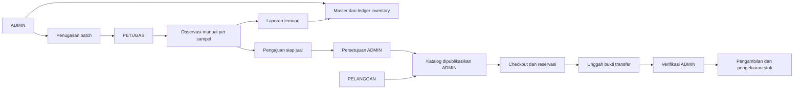
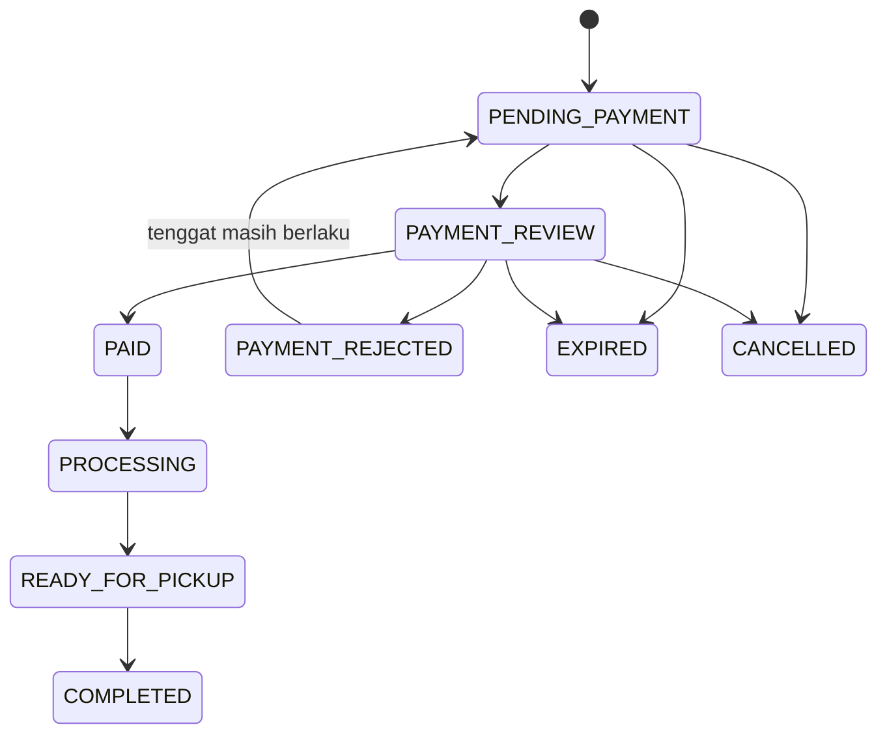

# UML awal — diturunkan dari PRD v2.0

Rancangan untuk F00.01–03, bukan klaim validasi lapangan.

Pengurangan stok fisik hanya saat pemenuhan atomik. Pelepasan reservasi tidak menambah fisik. Refund setelah pembayaran mengikuti kebijakan terpisah dengan audit.
